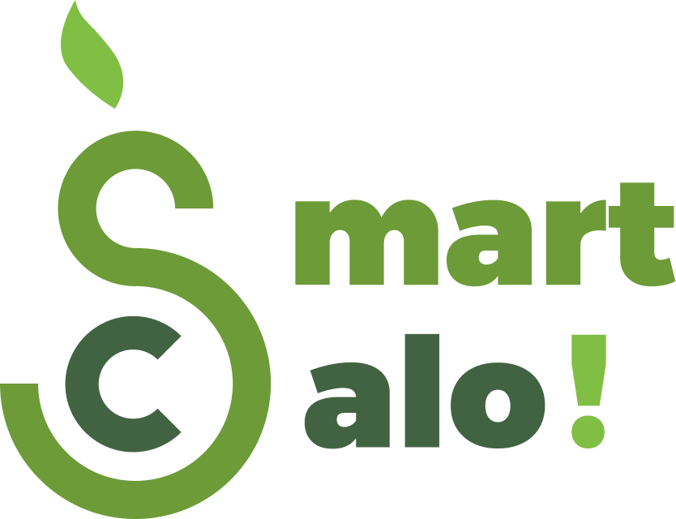

# 🥗 SmartCaloFE – Giải Pháp Quản Lý Dinh Dưỡng & Tập Luyện Thông Minh

<div align="center">
  <br><br>
  <em>Ứng dụng theo dõi calo, dinh dưỡng, gợi ý bữa ăn và lập kế hoạch tập luyện AI.</em>
</div>

---

## 🚀 Tổng Quan

**SmartCaloFE** là một ứng dụng đa năng tích hợp đầy đủ các tính năng theo dõi sức khỏe: từ scan mã vạch để ghi nhận calo, tính toán tỷ lệ dinh dưỡng, gợi ý thực đơn hàng ngày, đến tích hợp AI dự đoán xu hướng dinh dưỡng và quản lý lộ trình tập luyện cá nhân hóa.

Dự án được xây dựng bằng **React Native** (Expo) với kiến trúc **Feature-First**, kết nối với hệ thống Backend riêng phát triển bằng **ASP.NET Core Web API**. Ngoài ra, ứng dụng còn tích hợp **Firebase** cho các dịch vụ Storage và Notifications.

🔗 Backend Repository: https://github.com/machgiahao/SmartCaloBE

---

## ✨ Các Tính Năng Chính

### 📱 Quản Lý Dinh Dưỡng & Calo

- **AI Food Recognition:** Phân tích hình ảnh món ăn để ước tính calories và giá trị dinh dưỡng theo thời gian thực.
- **Scan mã vạch thông minh:** Tra cứu nhanh thông tin thực phẩm đóng gói thông qua barcode.
- **Báo cáo trực quan:** Biểu đồ calo nạp vào, tỷ lệ dinh dưỡng và tiến trình sức khỏe.
- **Theo dõi hàng ngày:** Quản lý bữa sáng, trưa, tối cùng gợi ý thực đơn phù hợp.

### 🤖 Dự Đoán AI

- **Prediction AI:** Dự đoán xu hướng cân nặng và đề xuất chế độ ăn hiệu quả.
- **Phân tích dữ liệu:** Tổng hợp dữ liệu nhiều ngày để đưa ra báo cáo sức khỏe chính xác.

### 🏋️ Chương Trình Tập Luyện

- **Lập kế hoạch tập:** Tùy chỉnh lộ trình tập luyện cho từng ngày trong tuần.
- **Ghi chép buổi tập:** Ghi nhận bài tập, cường độ và tiến độ.
- **Danh mục bài tập:** Thư viện bài tập phong phú với hướng dẫn chi tiết.

### 💳 Giao Dịch & Thành Viên

- **Quản lý đơn hàng:** Theo dõi các giao dịch liên quan đến gói thành viên.
- **Bình luận & Đánh giá:** Chức năng review món ăn và chương trình tập.

### 🔐 Bảo Mật

- Sử dụng `SecureStorage` kết hợp `AsyncStorage`, quản lý token và xác thực người dùng.
- Hỗ trợ đăng nhập qua **Google** và **Facebook**.

---

## 🛠️ Công Nghệ Sử Dụng (Tech Stack)

| Hạng mục         | Công nghệ                         |
| ---------------- | --------------------------------- |
| Framework        | React Native (Expo)               |
| Ngôn ngữ         | TypeScript                        |
| State Management | Redux Toolkit                     |
| Navigation       | React Navigation                  |
| HTTP Client      | Axios                             |
| Backend          | ASP.NET Core Web API              |
| Cloud Services   | Firebase (Storage, Notifications) |
| Utils            | Lodash                            |

---

## 📦 Yêu Cầu Môi Trường

Trước khi chạy dự án, đảm bảo đã cài đặt:

- **Node.js** >= 18.x
- **npm** >= 9.x hoặc **yarn** >= 1.22.x
- **Expo CLI**: `npm install -g expo-cli`
- **Android Studio** (nếu chạy Android emulator) hoặc **Xcode** (nếu chạy iOS simulator)

---

## 📂 Cấu Trúc Dự Án

```
├── app/                     # Cấu hình chính (Expo Router)
├── assets/                  # Hình ảnh, font, icons
├── components/              # Các thành phần UI tái sử dụng
│   ├── ui/                  # UI Components (Button, Card, Chart...)
│   └── tabIcons.tsx         # Icons cho tabs
├── constants/               # Màu sắc, font, hằng số
├── config/                  # Firebase config, API config
├── features/                # Cốt lõi Feature Architecture
│   ├── auth/                # Đăng nhập, đăng ký, xác thực
│   ├── chat/                # Chatbot gợi ý dinh dưỡng
│   ├── dishes/              # Danh sách món ăn
│   ├── excercises/          # Danh sách bài tập
│   ├── menus/               # Quản lý thực đơn
│   ├── payment/             # Thanh toán gói thành viên
│   ├── predictionAI/        # Logic AI dự đoán
│   ├── programs/            # Lộ trình tập luyện
│   ├── review/              # Đánh giá và phản hồi
│   ├── subscriptions/       # Quản lý gói thuê bao
│   ├── tracking/            # Theo dõi calo/dinh dưỡng
│   ├── users/               # Quản lý người dùng
│   └── workouts/            # Lịch tập, bài tập buổi
├── hooks/                   # Custom Hooks
├── redux/                   # Store và Slices
├── services/                # API Client, Interceptors
├── stores/                  # AsyncStorage, SecureStorage
├── types/                   # TypeScript Types
├── utils/                   # Helper functions (tính toán calo, filter ngày...)
└── README.md
```

---

## 🚀 Cách Chạy Dự Án

**1. Clone repository:**

```bash
git clone https://github.com/Sang1011/SmartCaloFE.git
cd SmartCaloFE
```

**2. Cài đặt dependencies:**

```bash
npm install
# hoặc
yarn install
```

**3. Cấu hình môi trường:**

- Sao chép file `.env.example` thành `.env` và điền các biến môi trường cần thiết.
- Cập nhật `config/firebase.ts` với thông tin Firebase project của bạn.

**4. Chạy ứng dụng:**

```bash
npx expo start
```

Sau đó quét QR code bằng **Expo Go** để chạy trên thiết bị thật, hoặc nhấn `a` / `i` để mở trên Android/iOS emulator.

---

## 📜 License

Dự án này được cấp phép theo [MIT License](LICENSE).

---

## 👨‍💻 Đội Ngũ Phát Triển

### Frontend

- Nguyễn Hoàng Tuệ Sang — [GitHub](https://github.com/Sang1011) — nguyenhoangtuesang@gmail.com

### Backend

Link: [SmartCaloBE](https://github.com/machgiahao/SmartCaloBE)

- Mạch Gia Hào
- Trần Trọng Tấn
